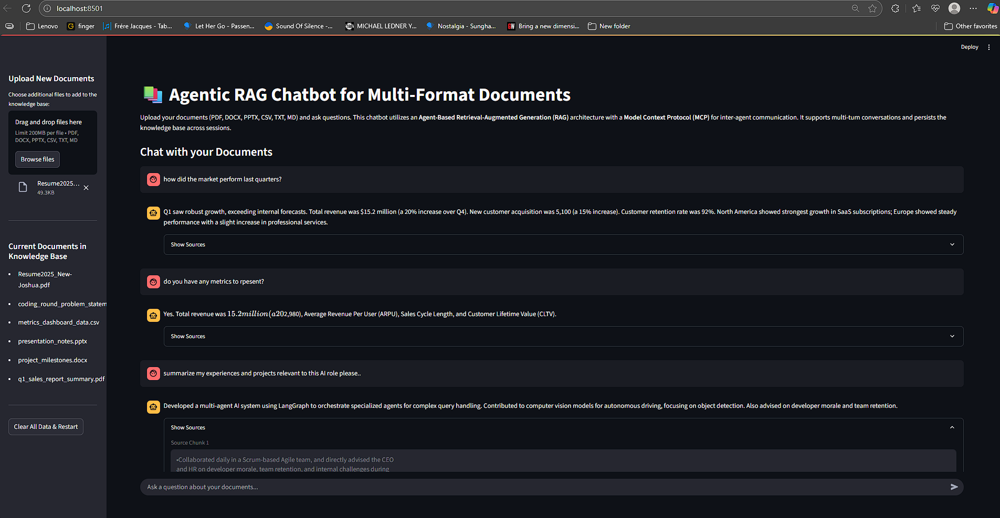

-----

# Agentic RAG Chatbot for Multi-Format Documents

**

## 📚 Project Overview

This project implements an advanced Retrieval-Augmented Generation (RAG) chatbot using a multi-agent architecture powered by Streamlit for the user interface. It's designed to interact with diverse document formats, providing accurate and contextually relevant answers by leveraging a persistent knowledge base. The system supports multi-turn conversations and automatically loads default documentation, while also allowing users to upload their own files.

## ✨ Features

  * **Multi-Format Document Support:** Ingests and queries PDFs, DOCX, PPTX, CSV, TXT, and Markdown files.
  * **Agent-Based Architecture:** Utilizes a Coordinator Agent to orchestrate various sub-agents (e.g., for retrieval, generation) for robust and modular processing.
  * **Model Context Protocol (MCP):** Employs MCP for structured and efficient inter-agent communication.
  * **Persistent Knowledge Base:** Documents are chunked, embedded, and stored in a FAISS vector store, which persists across application sessions, meaning you only build your knowledge base once.
  * **Automatic Default Document Ingestion:** Loads documents from a predefined `docs/` directory on startup.
  * **User Document Uploads:** Allows users to dynamically add new documents via the Streamlit interface.
  * **Multi-Turn Conversation:** Maintains conversation history to provide more coherent and context-aware responses.
  * **Source Citation:** Displays the relevant source chunks used to generate answers, enhancing transparency and trustworthiness.
  * **Clear Data Functionality:** A convenient button to clear all chat history, uploaded documents, and reset the knowledge base.

## 🏗️ Architecture Overview

The core of this RAG chatbot is its agentic design, managed by a `CoordinatorAgent`.

  * **`CoordinatorAgent`:** Acts as the central hub, receiving user queries and document upload requests. It then delegates these tasks to specialized sub-agents. It also manages the message queue for UI interaction.
  * **`RetrievalAgent` (Implied/Managed by Coordinator):** Responsible for indexing documents into a persistent vector store (FAISS) upon upload/ingestion, and for retrieving relevant document chunks based on user queries.
  * **`GenerationAgent` (Implied/Managed by Coordinator):** Takes the retrieved context and the user's query (along with conversation history) to generate a coherent and informed answer using a Large Language Model (LLM).
  * **Model Context Protocol (MCP):** A defined protocol for messages exchanged between the Coordinator Agent and other agents, ensuring structured communication for various tasks (e.g., `DOCUMENT_UPLOAD_REQUEST`, `QUERY_REQUEST`, `FINAL_RESPONSE_PAYLOAD`, `ERROR_RESPONSE_PAYLOAD`).
  * **Streamlit UI:** Provides an interactive web interface for document uploads, chat interactions, and displaying results including source citations.
  * **Persistent Storage:**
      * `uploaded_docs/`: Temporary storage for user-uploaded files.
      * `docs/`: Static directory for default project documentation.
      * `vector_store_data/`: Directory where the FAISS index and associated chunk data for the knowledge base are saved.

## 📄 Supported Document Types

The application supports the following document formats for ingestion:

  * `.pdf` (Portable Document Format)
  * `.docx` (Microsoft Word Document)
  * `.pptx` (Microsoft PowerPoint Presentation)
  * `.csv` (Comma Separated Values)
  * `.txt` (Plain Text File)
  * `.md` (Markdown File)

## 🚀 Setup and Installation

### Prerequisites

Before you begin, ensure you have the following installed:

  * Python 3.9+
  * `pip` (Python package installer)

### 1\. Clone the Repository

```bash
git clone <your-repo-url>
cd <your-repo-name>
```

### 2\. Create and Activate a Virtual Environment (Recommended)

```bash
python -m venv .venv
# On Windows:
.venv\Scripts\activate
# On macOS/Linux:
source .venv/bin/activate
```

### 3\. Install Dependencies

Install the required packages and modules using the command below.

```bash
pip install -r requirements.txt
```

### 4\. Set Up Environment Variables

You will need to provide your API key for the Large Language Model (LLM) you are using (e.g., OpenAI, Google Gemini). Create a `.env` file in the root directory of your project:

```
# Example for OpenAI
OPENAI_API_KEY="your_openai_api_key_here"

# Example for Google Gemini
# GOOGLE_API_KEY="your_google_api_key_here"
```

*(**Important:** Replace `"your_openai_api_key_here"` or `"your_google_api_key_here"` with your actual API key.)*

### 5\. Add Default Documents (Optional but Recommended)

Place any default documents (e.g., project documentation, FAQs) into the `docs/` directory. These will be automatically ingested when the application starts for the first time in a session.

```
project-root/
├── app.py
├── agents/
│   ├── coordinator_agent.py
│   └── ... (other agent files)
├── utils/
│   └── ... (utility files)
├── docs/
│   ├── project_manual.pdf
│   ├── faq.docx
│   └── README_info.md
├── uploaded_docs/ (created automatically, stores user uploads)
├── vector_store_data/ (created automatically, stores FAISS index)
└── .env
└── requirements.txt
```

## 🚀 Running the Application

```bash
streamlit run app.py
```

This will open the Streamlit application in your default web browser.

## 💡 How to Use

1.  **Initial Load:** On first run (or after clearing data), the application will automatically ingest documents from the `docs/` directory. You will see a success message in the sidebar.
2.  **Upload New Documents:** Use the "Upload New Documents" section in the sidebar to add more files to your knowledge base. Select your files and click "Open". The application will process and add them.
3.  **Chat with Documents:** Type your questions into the chat input box at the bottom of the main content area. The chatbot will leverage the ingested documents to provide answers.
4.  **View Sources:** For RAG-generated responses, click the "Show Sources" expander beneath the assistant's message to see the document chunks that informed the answer.
5.  **Clear All Data:** Click the "Clear All Data & Restart" button in the sidebar to reset the chat history, remove all uploaded documents from disk, and clear the vector store, effectively starting fresh.

## 🗑️ Clearing Data

The "Clear All Data & Restart" button performs the following actions:

  * Deletes the persistent vector store data from the `vector_store_data/` directory.
  * Removes all physically uploaded files from the `uploaded_docs/` directory.
  * Resets the Streamlit session state, clearing chat history and the list of currently loaded documents.
  * Forces a full application rerun, re-initializing the system (including re-ingesting default documents from `docs/`).

## 🔮 Future Enhancements (Ideas)

  * **Asynchronous Processing:** Implement truly asynchronous ingestion and querying using `asyncio` and `httpx` for better responsiveness, especially with large documents or busy LLMs.
  * **Progress Indicators:** More granular progress bars for document processing.
  * **Error Handling & Logging:** More robust error handling and detailed logging for debugging.
  * **Advanced Chunking Strategies:** Experiment with different text splitting techniques (e.g., semantic chunking, table-aware chunking).
  * **Multi-Modal RAG:** Extend to handle images, audio, or video if relevant.
  * **User Management & Permissions:** For multi-user scenarios.
  * **Cloud Deployment:** Instructions and configurations for deploying on platforms like AWS, GCP, Azure, or Hugging Face Spaces.
  * **Evaluation Metrics:** Integrate tools to evaluate RAG performance (e.g., Ragas, TruLens).
  * **More LLM Options:** Easily switch between different LLMs (e.g., Anthropic Claude, Llama 3 via Ollama).

## 🤝 Contributing

Contributions are welcome\! Please follow these steps:

1.  Fork the repository.
2.  Create a new branch (`git checkout -b feature/your-feature-name`).
3.  Make your changes.
4.  Commit your changes (`git commit -m 'Add new feature'`).
5.  Push to the branch (`git push origin feature/your-feature-name`).
6.  Create a Pull Request.

## 📄 License

This project is licensed under the MIT License.

-----